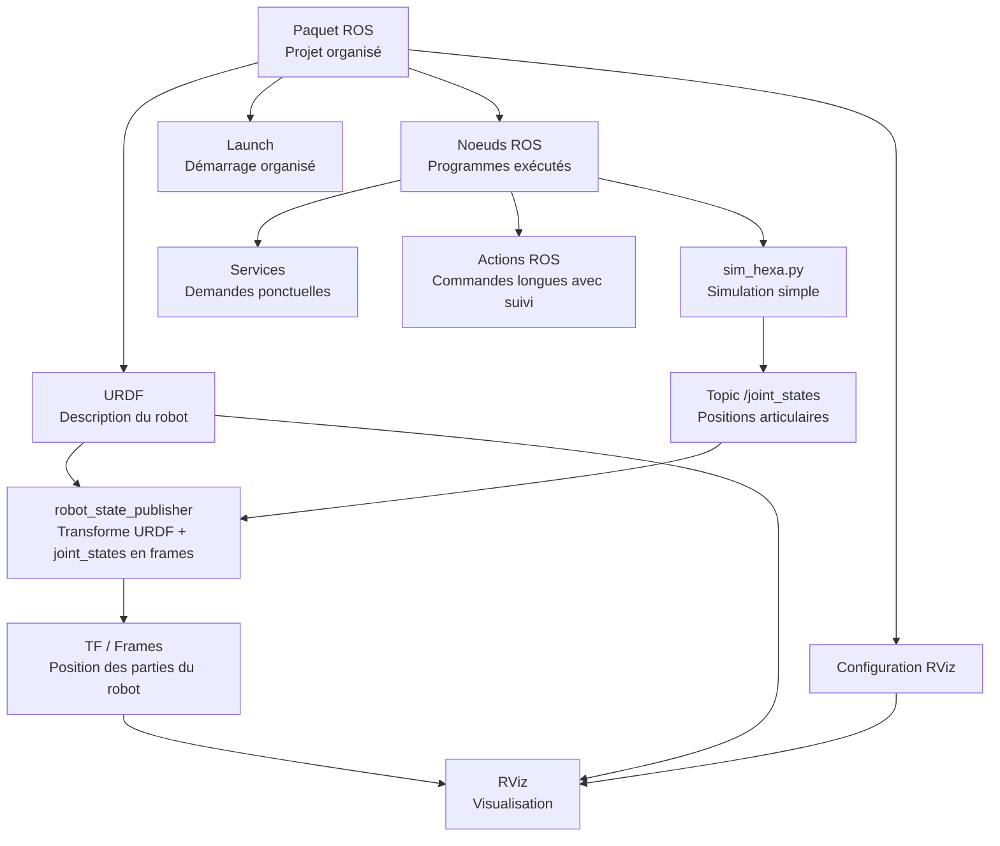

# Définitions ROS - Architecture globale du projet

## Objectif du document

Comprendre simplement les principaux termes ROS utilisés dans le projet de jumeau numérique de l'hexapode.

## Organigramme global



## Paquet ROS

### Définition

Un paquet ROS est un dossier organisé qui regroupe tout ce qui sert à une fonctionnalité robotique : scripts, description robot, fichiers de lancement, configuration RViz, documentation et tests.

### Fonctionnement

Le paquet sert de structure commune pour que ROS retrouve les fichiers et lance les bons noeuds.

### Architecture type pour notre projet

```text
hexa_simulation/
├── package.xml
├── CMakeLists.txt
├── scripts/
│   └── sim_hexa.py
├── urdf/
│   └── hexapode.urdf
├── launch/
│   └── display.launch
├── rviz/
│   └── hexapode.rviz
├── config/
│   └── params.yaml
└── docs/
    └── architecture.md
```

### Limites

- Le paquet n'est qu'une organisation : il ne garantit pas que le robot fonctionne.
- Une mauvaise architecture rend le projet difficile à relire.
- Les noms de fichiers et de topics doivent rester cohérents.

### Lien avec le projet

Le paquet contiendra le modèle URDF, le script `sim_hexa.py`, les fichiers de lancement et la configuration RViz.

## Topics

### Définition

Un topic est un canal de communication ROS. Un noeud publie des messages, un autre noeud les lit.

### Fonctionnement

Exemple :

- `sim_hexa.py` publie les angles des articulations sur `/joint_states`.
- RViz, via `robot_state_publisher`, utilise ces données pour afficher le robot qui bouge.

### Limites

- Un topic ne garantit pas qu'un message est reçu.
- Il sert surtout aux échanges continus.
- Si les noms ou types de messages sont faux, les noeuds ne communiquent pas correctement.

### Lien avec le projet

Topic principal du MVP :

```text
/joint_states
```

Il permet de transmettre les positions articulaires de l'hexapode.

## Services

### Définition

Un service ROS est une demande ponctuelle avec une réponse.

### Fonctionnement

Un noeud demande une action précise, un autre noeud répond.

Exemples possibles :

- réinitialiser la posture de l'hexapode ;
- demander l'état actuel de la simulation ;
- changer un paramètre simple.

### Limites

- Moins adapté aux informations continues.
- Bloquant si le service ne répond pas.
- Pas indispensable pour un MVP simple.

### Lien avec le projet

Pour le MVP, les services peuvent rester hors périmètre sauf demande du professeur.

## Actions ROS

### Définition

Une action ROS sert à lancer une commande longue avec suivi d'avancement et résultat final.

### Fonctionnement

Elle est utile quand une tâche prend du temps :

- lancer une séquence de marche ;
- suivre sa progression ;
- annuler la commande si besoin ;
- récupérer le résultat.

### Limites

- Plus complexe qu'un topic ou un service.
- Souvent inutile pour une première version.
- Demande une bonne définition de l'objectif, du retour d'état et du résultat.

### Lien avec le projet

Pour le MVP, les actions ROS ne sont pas prioritaires. Elles peuvent être envisagées plus tard pour commander une marche complète.

## URDF

### Définition

URDF signifie Unified Robot Description Format. C'est un fichier XML qui décrit la structure physique du robot.

### Fonctionnement

Il décrit :

- les parties du robot ;
- les articulations ;
- les axes de rotation ;
- les formes visibles ;
- les frames ;
- les liens parent/enfant entre les éléments.

### Limites

- L'URDF ne simule pas le comportement du robot.
- Il décrit la structure, pas l'intelligence du mouvement.
- Un URDF trop détaillé peut faire perdre beaucoup de temps.
- Les erreurs de frames ou de noms d'articulations bloquent rapidement RViz.

### Lien avec le projet

L'URDF de l'hexapode doit décrire :

- le corps central ;
- les 6 pattes ;
- les articulations principales ;
- les frames utiles ;
- des formes simples suffisantes pour RViz.

## RViz

### Définition

RViz est l'outil de visualisation de ROS. Il permet de voir le robot, ses frames, ses capteurs et certains messages ROS.

### Fonctionnement

Dans notre projet, RViz affiche :

- le modèle URDF ;
- les frames du robot ;
- les mouvements des articulations via `/joint_states`.

### Limites

- RViz visualise, mais ne simule pas la physique.
- Il ne gère pas les collisions réelles comme Gazebo.
- Si l'URDF ou les frames sont incorrects, l'affichage sera faux.

### Lien avec le projet

RViz est la preuve visuelle principale du MVP : l'hexapode doit apparaître et bouger de manière compréhensible.

## Résumé rapide

| Terme | Rôle simple | Priorité MVP |
|---|---|---|
| Paquet ROS | Organiser tous les fichiers du projet | Haute |
| Topics | Échanger des données en continu | Haute |
| Services | Faire une demande ponctuelle | Basse |
| Actions ROS | Lancer une commande longue avec suivi | Basse |
| URDF | Décrire la structure du robot | Haute |
| RViz | Visualiser le robot et ses mouvements | Haute |

## Chaîne MVP à retenir

```text
URDF simplifié
    +
sim_hexa.py
    +
/joint_states
    +
robot_state_publisher
    +
RViz
    =
hexapode visible et animé
```
